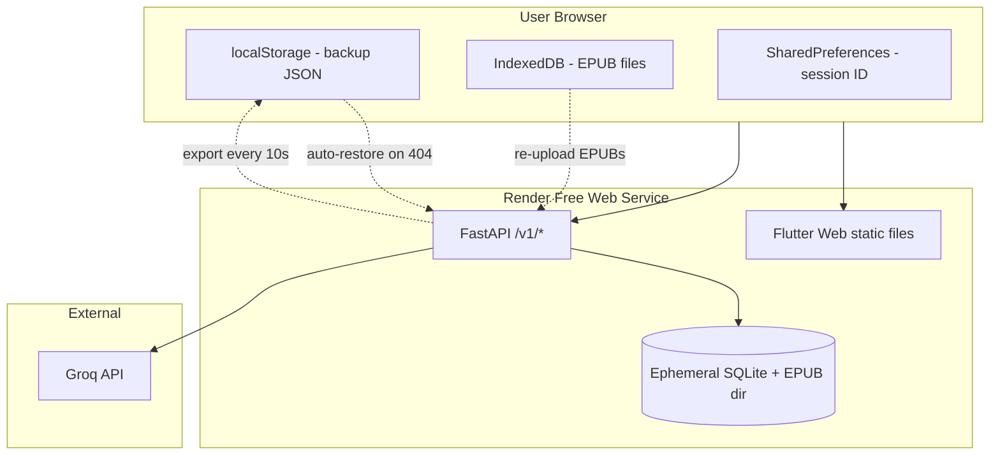

## Adjustments I recommend

### 1. EPUB files are not in the backup schema (critical)

`UserDataBackupRead` in `backup.py` includes book **metadata** (title, chapters, progress) but **not** the `.epub` binary. EPUBs live on the server at `data/books/{book_id}.epub`.

After a Render sleep/restart wipes disk, auto-restore would bring back highlights, games, and vault data — but **opening a book would fail** because the file is gone.

**Fix:** On web, store each uploaded EPUB in **IndexedDB** (localStorage is too small). On auto-restore, silently re-upload EPUBs from IndexedDB to the server. This stays invisible to the user and doesn't change the backup JSON schema.

### 2. Session is not persisted today

`sessionUserIdProvider` is in-memory only — a browser refresh sends users back to `/register` even if the server still has their data.

The plan mentions SharedPreferences, but nothing writes `sessionUserId` there yet (only `show_tour_on_login` is stored).

**Fix:** Persist `sessionUserId` in SharedPreferences on login/register and restore it at startup before routing.

### 3. Wrong error code in the plan

The plan says "404/401" — the API returns **404** when a user is missing (`user_routes.py`). No auth tokens are involved.

### 4. Hardcoded `localhost:8000` for book covers

`home_page.dart` and `library_shelf_page.dart` hardcode cover URLs. On Render those images would break.

**Fix:** Use `BookApi.baseUrl` (same pattern as other API clients), built with `--dart-define=RIVER_READER_API_URL=` for same-origin deployment.

### 5. Web import needs bytes, not file paths

Settings import uses `FilePicker` + `file.path`, which doesn't work reliably on web. Use `file.bytes` on web instead.

### 6. Minor plan correction

The web storage file path is correct: `backend/lib/src/storage/file_storage_manager_web.dart` (Dart shared package, not the Python backend).

---

## Revised implementation plan

### Phase A — Browser persistence (seamless, invisible)

| Task | What | User impact |
|------|------|-------------|
| A1 | Implement `localStorage` read/write in `file_storage_manager_web.dart` for backup JSON | None |
| A2 | Add `EpubBrowserStore` (IndexedDB) — save EPUB on upload, read on restore | None |
| A3 | Persist `sessionUserId` in SharedPreferences; hydrate on startup | Stays logged in after refresh |
| A4 | Startup restore service: if saved userId → ping backend → on 404 → import from localStorage → re-upload EPUBs from IndexedDB | Brief loading on cold start (~30–50s on free tier) |
| A5 | Extend splash/startup to wait for backend wake-up + restore before routing home | Slightly longer splash after inactivity |

### Phase B — Web-specific UX (minimal, as you requested)

| Task | What | User impact |
|------|------|-------------|
| B1 | "Export now" triggers real `.json` download via browser anchor (`RiverReader_{name}.json`) | **One-time** browser "Allow downloads?" prompt |
| B2 | Fix web import to use file bytes instead of path | Import works on web |
| B3 | Fix cover image URLs to use configurable API base URL | Covers work on Render |
| B4 | Optional one-time snackbar after first login: *"Your data is saved in this browser. Use Export in Settings for a backup file."* | Single dismissible message |

### Phase C — Render deployment (free tier)

| Task | What |
|------|------|
| C1 | `render.yaml` — one free Web Service |
| C2 | `Dockerfile` or build script: `flutter build web` → copy to FastAPI static dir |
| C3 | FastAPI serves Flutter Web at `/` and API at `/v1/*` (SPA fallback for client routes) |
| C4 | Env vars on Render: `RIVER_READER_GROQ_API_KEY`, `RIVER_READER_AI_ENABLED=true` |
| C5 | Build Flutter with empty/same-origin API URL so no CORS issues |
| C6 | `.env.example` / deploy docs with Render setup steps |

**Not included (per your requirements):**
- No Render persistent disk ($0 cost preserved)
- No offline mode changes (AI already requires network)
- No changes to `UserDataBackupRead` schema
- No changes to mobile/native behavior

---

## What users will notice

| Scenario | Experience |
|----------|------------|
| Normal daily use | **No change** — read, highlight, play games as today |
| Browser refresh | **Improvement** — stays logged in (today they get sent to register) |
| First manual export | Browser asks once to allow downloads |
| Server cold start (15+ min idle) | Loading spinner ~30–50s, then app continues normally; restore is silent |
| Clear browser data (not just cache) | Lose in-browser EPUBs + auto-backup; manual `.json` export still restores profile/highlights/games but **books need re-upload** |
| Incognito / different browser/device | Must sign in again; no data unless they import a manual backup |
| New device with backup file | Import restores everything except EPUBs — user re-adds books from their files |

---

## Architecture after deploy

---

## Summary

The original plan is ~80% there. The main addition is **IndexedDB for EPUBs + re-upload on restore** — without that, reading would break after every server sleep despite a perfect JSON backup.

Everything else is wiring you mostly already have: localStorage backup, session persistence, startup restore, Render single-service deploy, and a real download on manual export.

If this revised plan looks good, I'll implement in order **A → B → C** so persistence works before deploy config. Any preferences on the optional first-login snackbar (show vs skip)?